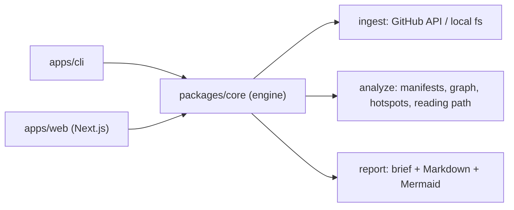

# RepoBrief

> Turn any public GitHub repo into an architecture map, key-file guide, hotspot
> list, and a "where to start" onboarding path. RepoBrief compresses the first
> confusing hour in an unfamiliar codebase into a trustworthy briefing.
> It is an **orientation layer, not a code review.**

[](https://github.com/conalh/repo-brief/actions/workflows/ci.yml)
[](./LICENSE)

<!-- Update the badge/links above with your actual GitHub repo path. -->

See a real example: [`REPO_BRIEF.md`](./REPO_BRIEF.md) is RepoBrief run on itself.

## What it does

Given a repo, RepoBrief answers the questions you ask in any new codebase:

- **What is this?** — language + framework detection (npm, Python, Rust, GitHub Actions).
- **How do I run it?** — dev/build/test commands pulled from manifests.
- **How is it organized?** — a subsystem map built from folders + a real import graph (JS/TS + Python), rendered as Mermaid.
- **What's risky?** — a ranked hotspot list (size, import centrality, test gaps).
- **What do I read first?** — an ordered onboarding path with a skip list.

Three depth modes: `fast` (no graph), `balanced` (default), `deep`.

## Architecture

RepoBrief is a TypeScript monorepo: a shared analysis engine with a CLI and a web
app as thin surfaces over it.



| Package | Purpose |
| --- | --- |
| `packages/core` | Analysis engine: ingest → classify → graph → report. |
| `apps/cli` | `repobrief` command-line tool. |
| `apps/web` | Next.js app: paste a URL, browse the brief, export Markdown. |

## Install (CLI)

```bash
npm install -g @repobrief/cli
repobrief inspect https://github.com/owner/repo
```

Or run without installing:

```bash
npx @repobrief/cli inspect owner/repo
```

## CLI usage

```bash
repobrief inspect https://github.com/owner/repo   # full brief (Markdown)
repobrief inspect .                                # a local directory
repobrief inspect . --mode deep                    # fast | balanced | deep
repobrief graph .                                  # Mermaid architecture graph only
```

Set `GITHUB_TOKEN` (see [`.env.example`](./.env.example)) to raise the GitHub API
rate limit from 60 to 5000 requests/hour.

## Web app

```bash
pnpm --filter @repobrief/web dev      # http://localhost:3000
```

Paste a public GitHub URL; the brief is computed synchronously, persisted to
SQLite by repo + commit SHA (so re-runs are cached and links are shareable), and
rendered across Overview / Architecture / Hotspots / Where-to-start tabs with a
Markdown export. The hosted surface only accepts GitHub references — it never
reads the server filesystem from user input.

Seed the landing-page demo briefs (a `GITHUB_TOKEN` avoids rate limits):

```bash
cd apps/web && GITHUB_TOKEN=... node --experimental-strip-types scripts/seed-demos.ts
```

Deployment notes (Vercel + the SQLite caveat) are in [`docs/DEPLOY.md`](./docs/DEPLOY.md).

## Use in CI

Drop [`docs/repobrief.example.yml`](./docs/repobrief.example.yml) into
`.github/workflows/` to attach a fresh `REPO_BRIEF.md` to every pull request.

## Develop

```bash
pnpm install
pnpm build       # build all packages (Turborepo)
pnpm test        # run all suites (Vitest)
pnpm typecheck
```

## Publish (maintainers)

`@repobrief/core` and `@repobrief/cli` publish together; pnpm rewrites the
`workspace:` dependency to the real version automatically.

```bash
pnpm -r publish --access public
```

## License

[MIT](./LICENSE)
