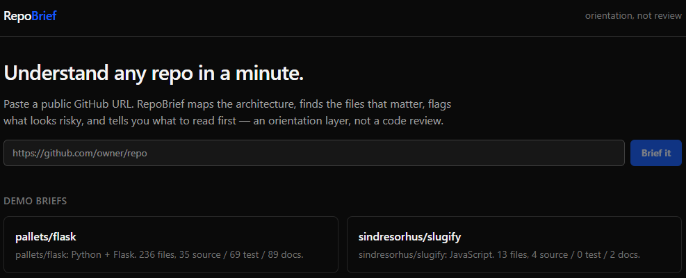
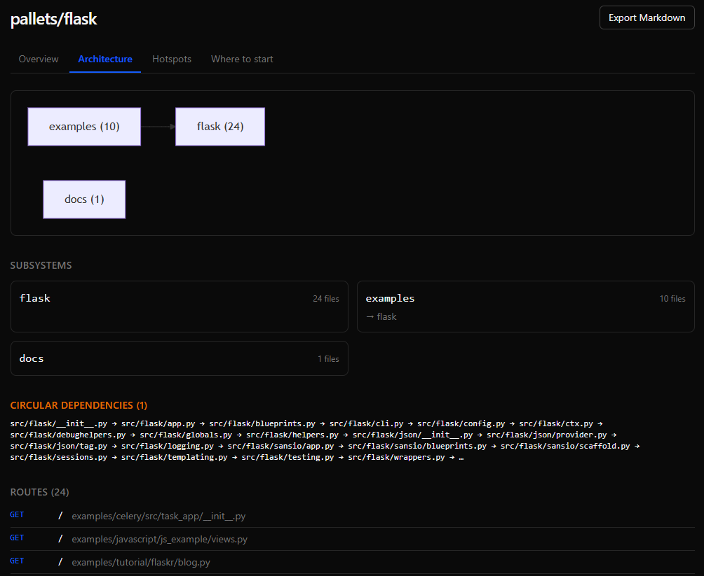
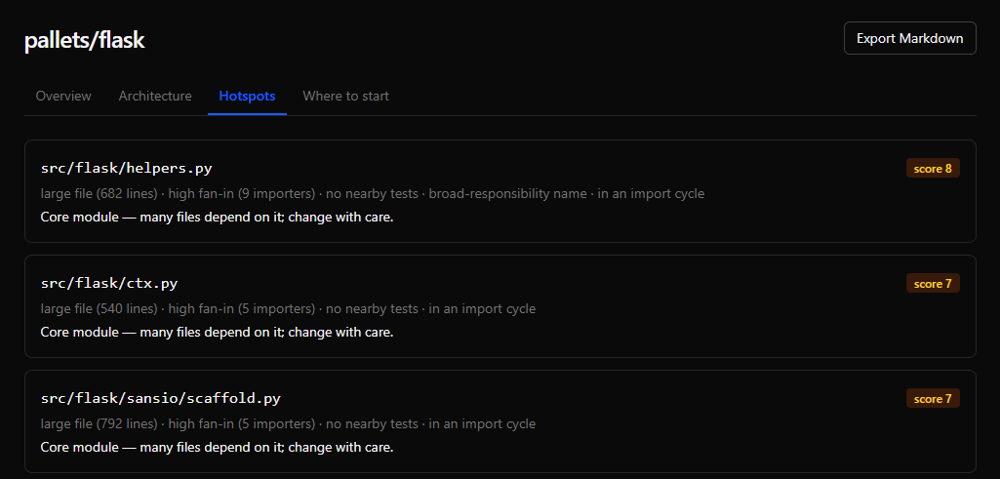
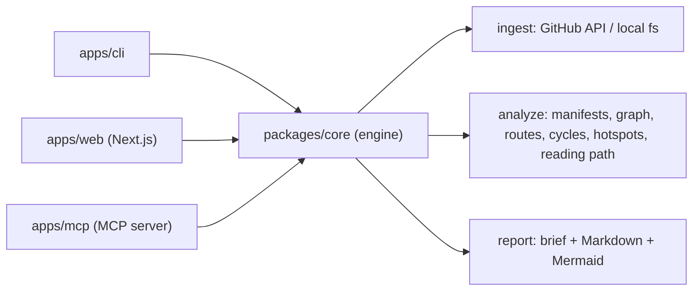

# RepoBrief



**An orientation layer for unfamiliar codebases.** Point it at any public GitHub
repo or local directory and it produces a structured briefing — language and
framework detection, run/build/test commands, a subsystem map built from a real
import graph, a ranked hotspot list, and an ordered "where to start" reading path —
each claim backed by file evidence. It is an orientation layer, **not** a code review.

[](https://github.com/conalh/repo-brief/actions/workflows/ci.yml)
[](https://www.npmjs.com/package/@repobrief/cli)


[](./LICENSE)

> **See it run →** [`REPO_BRIEF.md`](./REPO_BRIEF.md) is RepoBrief analyzing its
> own source. There is no hosted demo yet — run the CLI in two commands (below)
> or start the web app locally.

## Screenshots

| Architecture (subsystem map, cycles, routes) | Hotspots (ranked risk signals) |
| --- | --- |
|  |  |

## Sample output

`repobrief inspect . --mode deep` on this repo, abridged:

```markdown
repo-brief: TypeScript + Next.js + React. 98 files, 46 source / 24 test / 6 docs.

## How to run
- Build: `npm run build`
- Test:  `npm test`

## Where to start
1. `README.md`                       — Project overview.
2. `package.json`                    — Manifest: scripts, dependencies.
3. `apps/web/app/page.tsx`           — Entry point (app).
4. `packages/core/src/types.ts`      — Core module — 21 files depend on it.
...

## Hotspots
- `packages/core/src/types.ts` (score 4) — high fan-in (21 importers), no nearby tests.
```

The full Markdown brief is in [`REPO_BRIEF.md`](./REPO_BRIEF.md); the web app renders
the same data across tabs.

## Why this exists

Every developer has the same first hour in a new repo: open the README, scan the
tree, guess the architecture, hunt for the run scripts, find the routes, and hope
the tests pass. RepoBrief compresses that hour into a briefing you can trust because
**every statement links to its evidence** — the manifest a command came from, the
file that triggered a framework guess, the imports behind a "core module" label.

It is deliberately *not* a code reviewer or a semantic understander. It orients you,
labels its confidence, and gets out of the way.

## Run it

### Install the CLI

```bash
npm install -g @repobrief/cli       # or: npx @repobrief/cli ...
```

### Inspect a repo

```bash
repobrief inspect https://github.com/owner/repo   # a public GitHub repo
repobrief inspect .                                # a local directory
repobrief graph .                                  # Mermaid architecture graph only
```

Set `GITHUB_TOKEN` (see [`.env.example`](./.env.example)) to raise the GitHub API
rate limit from 60 to 5000 requests/hour.

### Depth modes

```bash
repobrief inspect . --mode fast       # metadata, manifests, entrypoints (no graph)
repobrief inspect . --mode balanced   # default: + import graph, subsystems, hotspots
repobrief inspect . --mode deep       # balanced + higher caps + commit-history churn
```

### Web app

```bash
pnpm install
pnpm --filter @repobrief/web dev      # http://localhost:3000
```

Paste a GitHub URL; the brief is computed synchronously, persisted to SQLite by
repo + commit SHA (so re-runs are cached and links are shareable), and rendered
across Overview / Architecture / Hotspots / Where-to-start tabs with Markdown export.

### In CI

Drop [`docs/repobrief.example.yml`](./docs/repobrief.example.yml) into
`.github/workflows/` to comment a fresh brief on every pull request.

## What it detects

| Source | What RepoBrief reads | Produces |
| --- | --- | --- |
| File extensions | per-language source counts | primary + secondary languages |
| `package.json` | scripts, dependencies, engines | npm commands, frameworks, Node runtime |
| `pyproject.toml` / `requirements.txt` | PEP 621 + Poetry deps | Python frameworks, `pytest` |
| `Cargo.toml` | dependencies, rust-version | cargo commands, Rust runtime |
| `.github/workflows/*.yml` | jobs and runners | CI surface |
| Conventions | `next.config.*`, `app/`, `manage.py`, … | framework + entrypoint detection |

Frameworks are reported with a **confidence** label — `high` when a dependency *and*
a conventional file agree, `medium` for a single signal.

## The analysis engine

`packages/core` ingests a repo into a normalized snapshot, then layers analysis on top.

- **Ingestion** — GitHub repos are pulled as a single `codeload` tarball (one
  download, served from memory), so analysis makes **zero rate-limited API calls**
  in balanced mode and stays fast on large repos: `nestjs/nest` (~2,100 files)
  briefs in under a second. Falls back to the trees + contents API if needed.
- **Import graph** — lightweight JS/TS, Python, and Go extractors resolve relative
  paths, `tsconfig` path aliases, monorepo **workspace packages** (so cross-package
  imports like `@scope/core` become real edges), Python package/relative imports, and
  Go module-path imports to in-repo files. External (`node_modules` / stdlib) imports
  are dropped.
- **Subsystems** — files are grouped by folder convention (monorepo `packages/*`,
  `src/*`, top-level dirs), then refined by the import graph into `dependsOn` edges,
  rendered as Mermaid.
- **Routes** — a route map from Next.js file conventions (App + Pages router, with
  dynamic `:segment`s) and from FastAPI/Flask/Express handlers, so you can see the
  HTTP surface and which file serves each path.
- **Circular dependencies** — Tarjan SCC over the import graph flags files that
  (transitively) import each other; cycle membership is also a hotspot signal.
- **Hotspots** — source files are scored against signals; only files that score are
  surfaced, highest first:

  | Signal | Score | Recommendation |
  | --- | :---: | --- |
  | Large file (≥ 300 lines) | +2 | Read in sections or split |
  | High fan-in (≥ 5 importers) | +2 | Core module — change with care |
  | High fan-out (≥ 10 imports) | +1 | Worth a look |
  | No nearby tests | +2 | Verify behavior before changing |
  | Broad-responsibility name (`utils`, `helpers`, `manager`, `controller`) | +1 | Likely mixes concerns |

  "Nearby tests" counts a same-stem test *or* any test in the same directory, so
  well-tested folders aren't flagged. In **deep mode**, an additional +2 high-churn
  signal is added from commit history (local `git log`, or the GitHub commits API).

- **Reading path** — an ordered onboarding route: README → manifest → entrypoints →
  most-depended-on core modules → a real test, plus a skip list of generated/asset files.

## The web app

`apps/web` is a Next.js (App Router) app and a thin surface over the engine. Briefs
run synchronously and persist to a store that auto-selects its backend: local
**SQLite** by default (zero-config dev), or remote **libSQL/Turso** when
`TURSO_DATABASE_URL` is set — which is what makes a serverless deploy work. The
hosted surface only accepts GitHub references — it never reads the server
filesystem from user input.

Seed the landing-page demo briefs once the app is running:

```bash
curl -X POST http://localhost:3000/api/demo/seed
```

## Extending it

Adding a framework is a one-line rule in
[`packages/core/src/classify/framework.ts`](./packages/core/src/classify/framework.ts):

```ts
{ name: 'Svelte', dependency: 'svelte' }
{ name: 'Next.js', dependency: 'next', filePattern: /(^|\/)next\.config\.[a-z]+$/ }
```

A new manifest format is a parser in
[`packages/core/src/analyze/manifests/`](./packages/core/src/analyze/manifests) plus
an entry in its `parserFor` switch. A new language for the import graph is an extractor
alongside [`imports-js.ts`](./packages/core/src/graph/imports-js.ts) /
[`imports-python.ts`](./packages/core/src/graph/imports-python.ts) /
[`imports-go.ts`](./packages/core/src/graph/imports-go.ts).

## Tests

117 tests (109 engine + 8 web). The engine has unit coverage of every manifest
parser, the import resolvers, subsystem grouping, hotspot ranking, and the
reading path, plus end-to-end runs over checked-in JS/TS, Python, Go, and Rust
fixtures — ~96% statement coverage. The web lib covers the SQLite store
round-trip and the cache-key logic.

```bash
pnpm test                                  # all suites (Vitest)
pnpm --filter @repobrief/core test:coverage
pnpm typecheck
pnpm build
```

## Use with an AI agent (MCP)

`apps/mcp` is a Model Context Protocol server exposing `inspect_repo` and
`repo_graph` tools, so an agent can orient itself in a repo before working in it.
Register it with any MCP client (e.g. Claude Code / Claude Desktop):

```json
{
  "mcpServers": {
    "repobrief": {
      "command": "npx",
      "args": ["-y", "@repobrief/mcp"],
      "env": { "GITHUB_TOKEN": "<optional, for higher rate limits>" }
    }
  }
}
```

Then ask the agent to "brief owner/repo" or "brief this directory" and it will call
the tool and read the result.

## Deploy

The web app runs anywhere Next.js does. Its store auto-selects **SQLite** (local /
single-instance hosts with a persistent disk) or **libSQL/Turso** when
`TURSO_DATABASE_URL` is set (serverless). Full notes, env vars, and a `vercel.json`
are in [`docs/DEPLOY.md`](./docs/DEPLOY.md).

## Architecture

A TypeScript monorepo (pnpm + Turborepo): one analysis engine, three thin surfaces.



| Package | Purpose |
| --- | --- |
| `packages/core` | Analysis engine: ingest → classify → graph → report. |
| `apps/cli` | `repobrief` command-line tool. |
| `apps/web` | Next.js app: paste a URL, browse the brief, export Markdown. |
| `apps/mcp` | MCP server so an AI agent can brief a repo before working in it. |

See [`PLAN.md`](./PLAN.md) for the full product spec and [`ROADMAP.md`](./ROADMAP.md)
for the milestone sequence that took it from plan to working software.

## Status

V1 feature-complete and then some: CLI, web, and an MCP server all work
end-to-end against real repos, with circular-dependency detection, a route map,
and deep-mode churn analysis. Tarball ingestion keeps it fast — a ~2,100-file
repo briefs in under a second, well inside the 30s/90s targets. The web store
runs on local SQLite or hosted Turso (see [`docs/DEPLOY.md`](./docs/DEPLOY.md)).

## License

[MIT](./LICENSE)
