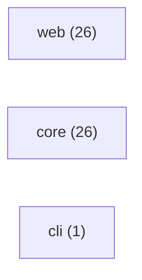

# RepoBrief

repo-brief: TypeScript + Next.js + React. 109 files, 53 source / 27 test / 6 docs.

## Tech stack

- **Languages:** TypeScript, JavaScript
- **Next.js** _(high)_ — dependency "next"; file apps/web/next.config.mjs
- **React** _(medium)_ — dependency "react"

## How to run

- **Build:** `npm run build`
- **Test:** `npm test`

## Entrypoints

- **app:** `apps/web/app/page.tsx` — Next.js app router page

## Architecture

- **web** (26 files)
- **core** (26 files)
- **cli** (1 files)

## Where to start

1. `README.md` — Project overview — what this is and how to run it.
2. `package.json` — Manifest — scripts, dependencies, and entry config.
3. `apps/web/app/page.tsx` — Entry point (app) — where execution begins.
4. `packages/core/src/types.ts` — Core module — 22 files depend on it.
5. `packages/core/src/graph/index.ts` — Core module — 4 files depend on it.
6. `apps/web/lib/store.ts` — Core module — 3 files depend on it.
7. `apps/web/lib/brief-id.test.ts` — A test — concrete usage and expected behavior.

_Safe to skip: 1 generated/asset files._

## Hotspots

- `packages/core/src/types.ts` _(score 6)_ — high fan-in (22 importers), frequently changed (6 recent commits), no nearby tests. Core module — many files depend on it; change with care.
- `packages/core/src/analyze/pipeline.ts` _(score 3)_ — high fan-out (11 imports), frequently changed (5 recent commits). Actively churning — recent, frequent edits; expect it to keep moving.
- `packages/core/src/index.ts` _(score 3)_ — high fan-out (17 imports), frequently changed (4 recent commits). Actively churning — recent, frequent edits; expect it to keep moving.
- `apps/cli/src/index.ts` _(score 2)_ — frequently changed (4 recent commits). Actively churning — recent, frequent edits; expect it to keep moving.
- `apps/web/app/api/briefs/[id]/export.md/route.ts` _(score 2)_ — no nearby tests. No tests found — verify behavior before changing.
- `apps/web/app/api/briefs/[id]/route.ts` _(score 2)_ — no nearby tests. No tests found — verify behavior before changing.
- `apps/web/app/api/briefs/route.ts` _(score 2)_ — no nearby tests. No tests found — verify behavior before changing.
- `apps/web/app/api/demo/briefs/route.ts` _(score 2)_ — no nearby tests. No tests found — verify behavior before changing.
- `apps/web/app/api/demo/seed/route.ts` _(score 2)_ — no nearby tests. No tests found — verify behavior before changing.
- `apps/web/app/briefs/[id]/layout.tsx` _(score 2)_ — no nearby tests. No tests found — verify behavior before changing.
- `apps/web/app/layout.tsx` _(score 2)_ — no nearby tests. No tests found — verify behavior before changing.
- `apps/web/components/brief-nav.tsx` _(score 2)_ — no nearby tests. No tests found — verify behavior before changing.
- `apps/web/components/repo-input.tsx` _(score 2)_ — no nearby tests. No tests found — verify behavior before changing.
- `apps/web/lib/analyze-service.ts` _(score 2)_ — frequently changed (4 recent commits). Actively churning — recent, frequent edits; expect it to keep moving.
- `apps/web/lib/store.ts` _(score 2)_ — frequently changed (3 recent commits). Actively churning — recent, frequent edits; expect it to keep moving.

## File breakdown

| Kind | Count |
| --- | ---: |
| source | 53 |
| test | 27 |
| docs | 6 |
| config | 15 |
| workflow | 1 |
| generated | 1 |
| unknown | 6 |

_Generated 2026-05-27T05:03:43.517Z · deep mode._
