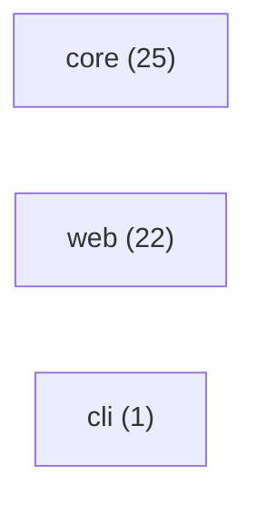

# RepoBrief

repo-brief: TypeScript + Next.js + React. 102 files, 48 source / 26 test / 6 docs.

## Tech stack

- **Languages:** TypeScript, JavaScript
- **Next.js** _(high)_ — dependency "next"; file apps/web/next.config.mjs
- **React** _(medium)_ — dependency "react"

## How to run

- **Build:** `npm run build`
- **Test:** `npm test`

## Entrypoints

- **app:** `apps/web/app/page.tsx` — Next.js app router page

## Architecture

- **core** (25 files)
- **web** (22 files)
- **cli** (1 files)

## Where to start

1. `README.md` — Project overview — what this is and how to run it.
2. `package.json` — Manifest — scripts, dependencies, and entry config.
3. `apps/web/app/page.tsx` — Entry point (app) — where execution begins.
4. `packages/core/src/types.ts` — Core module — 21 files depend on it.
5. `packages/core/src/graph/index.ts` — Core module — 4 files depend on it.
6. `apps/web/lib/store.ts` — Core module — 3 files depend on it.
7. `apps/web/lib/brief-id.test.ts` — A test — concrete usage and expected behavior.

_Safe to skip: 1 generated/asset files._

## Hotspots

- `packages/core/src/types.ts` _(score 4)_ — high fan-in (21 importers), no nearby tests. Core module — many files depend on it; change with care.
- `apps/web/app/api/briefs/[id]/export.md/route.ts` _(score 2)_ — no nearby tests. No tests found — verify behavior before changing.
- `apps/web/app/api/briefs/[id]/route.ts` _(score 2)_ — no nearby tests. No tests found — verify behavior before changing.
- `apps/web/app/api/briefs/route.ts` _(score 2)_ — no nearby tests. No tests found — verify behavior before changing.
- `apps/web/app/api/demo/briefs/route.ts` _(score 2)_ — no nearby tests. No tests found — verify behavior before changing.
- `apps/web/app/briefs/[id]/layout.tsx` _(score 2)_ — no nearby tests. No tests found — verify behavior before changing.
- `apps/web/app/layout.tsx` _(score 2)_ — no nearby tests. No tests found — verify behavior before changing.
- `apps/web/components/brief-nav.tsx` _(score 2)_ — no nearby tests. No tests found — verify behavior before changing.
- `apps/web/components/repo-input.tsx` _(score 2)_ — no nearby tests. No tests found — verify behavior before changing.
- `apps/web/next-env.d.ts` _(score 2)_ — no nearby tests. No tests found — verify behavior before changing.
- `apps/web/postcss.config.mjs` _(score 2)_ — no nearby tests. No tests found — verify behavior before changing.
- `apps/web/scripts/seed-demos.ts` _(score 2)_ — no nearby tests. No tests found — verify behavior before changing.
- `apps/web/vitest.config.ts` _(score 2)_ — no nearby tests. No tests found — verify behavior before changing.
- `packages/core/vitest.config.ts` _(score 2)_ — no nearby tests. No tests found — verify behavior before changing.
- `packages/core/src/analyze/pipeline.ts` _(score 1)_ — high fan-out (10 imports). Worth a look.

## File breakdown

| Kind | Count |
| --- | ---: |
| source | 48 |
| test | 26 |
| docs | 6 |
| config | 15 |
| workflow | 1 |
| generated | 1 |
| unknown | 5 |

_Generated 2026-05-27T04:43:06.247Z · deep mode._
