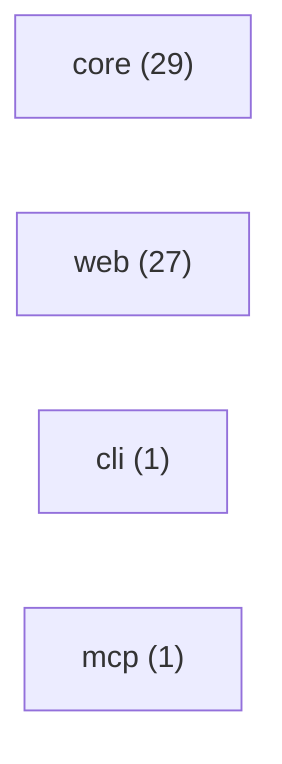

# RepoBrief

repo-brief: TypeScript + Next.js + React. 117 files, 58 source / 28 test / 6 docs.

## Tech stack

- **Languages:** TypeScript, JavaScript
- **Next.js** _(high)_ — dependency "next"; file apps/web/next.config.mjs
- **React** _(medium)_ — dependency "react"

## How to run

- **Build:** `npm run build`
- **Test:** `npm test`

## Entrypoints

- **app:** `apps/web/app/page.tsx` — Next.js app router page

## Architecture

- **core** (29 files)
- **web** (27 files)
- **cli** (1 files)
- **mcp** (1 files)

## Routes

- `/` — apps/web/app/page.tsx
- `/` — packages/core/fixtures/mini-repo/app/page.tsx
- `/api/briefs` — apps/web/app/api/briefs/route.ts
- `/api/briefs/:id` — apps/web/app/api/briefs/[id]/route.ts
- `/api/briefs/:id/export.md` — apps/web/app/api/briefs/[id]/export.md/route.ts
- `/api/demo/briefs` — apps/web/app/api/demo/briefs/route.ts
- `/api/demo/seed` — apps/web/app/api/demo/seed/route.ts
- `/briefs/:id` — apps/web/app/briefs/[id]/page.tsx
- `/briefs/:id/architecture` — apps/web/app/briefs/[id]/architecture/page.tsx
- `/briefs/:id/hotspots` — apps/web/app/briefs/[id]/hotspots/page.tsx
- `/briefs/:id/start` — apps/web/app/briefs/[id]/start/page.tsx
- `GET` `/x` — packages/core/src/analyze/routes/handlers.ts
- `POST` `/x` — packages/core/src/analyze/routes/handlers.ts

## Where to start

1. `README.md` — Project overview — what this is and how to run it.
2. `package.json` — Manifest — scripts, dependencies, and entry config.
3. `apps/web/app/page.tsx` — Entry point (app) — where execution begins.
4. `packages/core/src/types.ts` — Core module — 25 files depend on it.
5. `packages/core/src/graph/index.ts` — Core module — 4 files depend on it.
6. `apps/web/lib/store.ts` — Core module — 3 files depend on it.
7. `apps/web/lib/brief-id.test.ts` — A test — concrete usage and expected behavior.

_Safe to skip: 1 generated/asset files._

## Hotspots

- `packages/core/src/types.ts` _(score 6)_ — high fan-in (25 importers), frequently changed (8 recent commits), no nearby tests. Core module — many files depend on it; change with care.
- `packages/core/src/ingest/github.ts` _(score 4)_ — large file (314 lines), frequently changed (3 recent commits). Actively churning — recent, frequent edits; expect it to keep moving.
- `packages/core/src/analyze/pipeline.ts` _(score 3)_ — high fan-out (12 imports), frequently changed (7 recent commits). Actively churning — recent, frequent edits; expect it to keep moving.
- `packages/core/src/index.ts` _(score 3)_ — high fan-out (18 imports), frequently changed (6 recent commits). Actively churning — recent, frequent edits; expect it to keep moving.
- `apps/cli/src/index.ts` _(score 2)_ — frequently changed (4 recent commits). Actively churning — recent, frequent edits; expect it to keep moving.
- `apps/web/app/api/briefs/[id]/export.md/route.ts` _(score 2)_ — no nearby tests. No tests found — verify behavior before changing.
- `apps/web/app/api/briefs/[id]/route.ts` _(score 2)_ — no nearby tests. No tests found — verify behavior before changing.
- `apps/web/app/api/briefs/route.ts` _(score 2)_ — no nearby tests. No tests found — verify behavior before changing.
- `apps/web/app/api/demo/briefs/route.ts` _(score 2)_ — no nearby tests. No tests found — verify behavior before changing.
- `apps/web/app/api/demo/seed/route.ts` _(score 2)_ — no nearby tests. No tests found — verify behavior before changing.
- `apps/web/app/briefs/[id]/architecture/page.tsx` _(score 2)_ — frequently changed (3 recent commits). Actively churning — recent, frequent edits; expect it to keep moving.
- `apps/web/app/briefs/[id]/layout.tsx` _(score 2)_ — no nearby tests. No tests found — verify behavior before changing.
- `apps/web/app/layout.tsx` _(score 2)_ — no nearby tests. No tests found — verify behavior before changing.
- `apps/web/components/brief-nav.tsx` _(score 2)_ — no nearby tests. No tests found — verify behavior before changing.
- `apps/web/components/mermaid-graph.tsx` _(score 2)_ — no nearby tests. No tests found — verify behavior before changing.

## File breakdown

| Kind | Count |
| --- | ---: |
| source | 58 |
| test | 28 |
| docs | 6 |
| config | 17 |
| workflow | 1 |
| generated | 1 |
| unknown | 6 |

_Generated 2026-05-27T05:26:05.549Z · deep mode._
